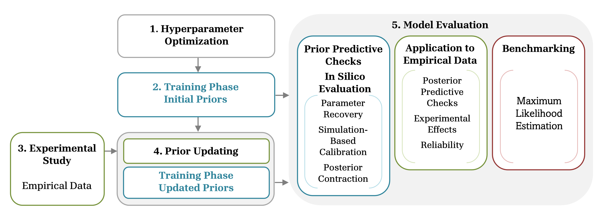

# Amortized Bayesian Workflow of the Diffusion Model for Conflict Tasks

This repository contains the work of Schaefer et al. (2025). 

We propose a generalized Amortized Bayesian Workflow to yield optimal performance in the parameter estimation of cognitive models as well as pretrained networks for Amortized Bayesian Inference of the Diffusion Model for Conflict Tasks (Ulrich et al., 2015).





## 📁 Repository Structure

* **`dmc/`**

  Includes the simulator function `DMC()` in `dmc_simulator.py` as well as helper functions to fit empirical data in `dmc_helpers.py`
  
  
* **`notebooks/`**

  Comprehensive examples for
  
  * Running automated hyperparameter optimization using `optuna`
  * Training new networks
  * Apply pretrained networks to empirical data


* **`optuna_results/`**

  Results from the **Hyperparameter Optimization** Phase using `scripts/dmc_optuna.py`.
  
* **`training/`**

  Includes the scripts used in the **Training Phases** to train all four networks based on either initial or updated priors and either including or excluding trial-to-trial variability of the non-decision time.
  
* **`plot_scripts/`**

  All scripts that were used to create the plots in the paper:
  
  * `prior_predictive_check.py`: **Prior Predictive Checks** of initial and updated priors against empirical data.
  
  * **In Silico Evaluation** Phase:
  
    * `diagnostics.py`: computation of all metrics for a fixed number of trials.
    * `metrics_num_obs.py`: computation of Recovery, Simulation-Based Calibration and Posterior Contraction for a varying number of trials between 50 and 1000.
  
  * **Application to Empirical Data** Phase:
    * `experimental_effects.py`: computation of standardized mean differences between experimental conditions (narrow vs. wide stimuli spacing)

    * `posterior_predictive_check.py`: Posterior Predictive Checks of individual RT and Accuracy Data, as well as correlation between mean RT, RT quantiles and mean accuracy.
    * `posterior_predictive_check_delta_functions.py`: Posterior Predictive Check of individual delta functions.
    * `posterior_reliability.py`: Split-Half correlation between individual parameter estimates for seven data sets.

  
  
* **`scripts/`**

  Additional scripts:
  
  * `dmc_optuna.py`: automated hyperparameter optimization
  * `prior_updating.py`: updating of priors in the **Prior Updating** Phase using the networks trained on initial priors
  * `simulate_data.py`: data simulation used in the **Benchmarking** Phase 
  

  
  
## Citation

If you use this project, please cite it as:

```bibtex
@article{schaefer2025amortized,
  title={Amortized Bayesian Workflow for Modeling Congruency Effects Using the Diffusion Model for Conflict Tasks},
  author={Schaefer, Simon B., Goettmann, J., Radev Stefan T., and Schubert, Anna-Lena},
  journal={Preprint},
  year={2025},
  doi={...}
}
```
