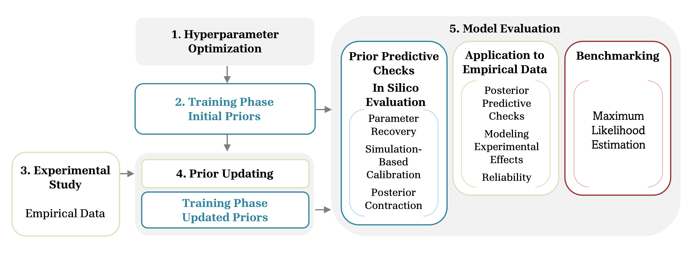

# Amortized Bayesian Workflow of the Diffusion Model for Conflict Tasks

This repository contains the work of [Schaefer et al. (2026, in press) ](https://osf.io/preprints/psyarxiv/dypcw_v2)

We propose a **generalized Amortized Bayesian Workflow** to yield optimal performance in the parameter estimation of cognitive models as well as pretrained networks for Amortized Bayesian Inference of the **Diffusion Model for Conflict Tasks** (Ulrich et al., 2015).





## 🔧 Project Status

This project is currently under construction.

## 🚀 Getting Started

### Download the Code

First, open a terminal on your local machine and navigate to the directory where you want to store the project. Then, run the following command to clone the repository to your local machine:

```
git clone https://github.com/simschaefer/amortized-dmc.git
```

Alternatively, download the repository by clicking on `Code` on the right-hand side, click `Download ZIP` and extract the .zip file in the directory where you want to store the project.

### Install Dependencies

All packages that were used in this project are listed in `requirements.txt`. Create a fresh conda environment `amortized_dmc`:

```
conda create --name amortized_dmc python=3.11.11
```

and activate the environment:

```
conda activate amortized_dmc
```

Install pip:

```
conda install pip
```

And all dependencies:

```
pip install -r requirements.txt
```

## Tutorial Notebooks

To guide you through the key steps of our analyses, we provide comprehensive Jupyter notebooks covering the following topics:

* [DMC data simulation](notebooks/dmc_introduction.ipynb)
* [Hyperparameter optimization](notebooks/hyperparameter_optimization.ipynb)
* [Application of pretrained networks on empirical data](notebooks/apply_pretrained_networks.ipynb)


## 📁 Repository Structure

* **`dmc/`**

  Includes the simulator function `DMC()` in `dmc_simulator.py` as well as helper functions to fit empirical data in `dmc_helpers.py`
  
* **`empirical_data/`**
  
  Includes data from the experiment separately for each spacing condition:
    * Narrow spacing: `experiment_data_narrow.csv`
    * Wide spacing: `experiment_data_wide.csv`

    
* **`model_specs/`**

  Stored information about training hyperparameters, network hyperparameters and simulator specifications used for the training of all networks. The names correspond with those of the pretrained networks.

* **`notebooks/`**

  Comprehensive examples for
  
  * Data simulation using the DMC simulator
  * Running automated hyperparameter optimization using `optuna`
  * Apply pretrained networks to empirical data

* **`optuna_results/`**

  Results from the **Hyperparameter Optimization** Phase using `scripts/dmc_optuna.py`.
  
* **`training/`**

  Includes the scripts used in the **Training Phases** to train all four networks based on either initial or updated priors and either including or excluding trial-to-trial variability of the non-decision time.

* **`training_checkpoints/`**

  Includes the checkpoints of the trained networks for each condition.

* **`scripts/`**

  * `dmc_optuna.py`: automated hyperparameter optimization
  * `empirical_estimates.py`: Application of the trained networks on the empirical data.
  * `prior_updating.py`: updating of priors in the **Prior Updating** Phase using the networks trained on initial priors
  * `simulate_data.py`: data simulation used in the **Benchmarking** Phase 
  * `drift_dm_fitting.R`: Parameter estimation for simulated data (`simulate_data.py`) using dRiftDM
  * `metrics_num_obs.py`: Computation of all in silico metrics for a varying number of trials between 50 and 1000.
  * `posterior_reliability.py`: Computes Split-Half correlation between individual parameter estimates for seven data sets.
  * `posterior_predictive_check_data.py`: Posterior Predictive Checks of individual RT and Accuracy Data. Stores resimulations as pandas DataFrame.

cdf_data, cdf_data_emp,
* **`plot_scripts/`**

  All scripts and notebooks that were used to create the plots in the paper:
  
  * `prior_predictive_check.py`: **Prior Predictive Checks** of initial and updated priors against empirical data.
  
  * **In Silico Evaluation** Phase:
  
    * `diagnostics.py`: Computation of Recovery, Simulation-Based Calibration and Posterior Contraction for a fixed number of trials.
    * `plots_metrics_num_obs.ipynb`: Plotting data computed by `scripts/metrics_num_obs.py`
    
  * **Application to Empirical Data** Phase:
    * `empirical_cdf_caf_delta_plot.ipynb`: Depiction of empirical data as CDF, CAF and Delta plots.
    * `experimental_effects.ipynb`: Computation of standardized mean differences between experimental conditions (narrow vs. wide stimuli spacing).
    * `posterior_predictive_checks.ipynb`: Plotting data from `scripts/posterior_predictive_check_data.py` as aggregated CAF, CDF and Delta plots.
    * `posterior_predictive_checks_q_correlations.ipynb`: Plotting data from `scripts/posterior_predictive_check_data.py` quantile correlations between empirical and resimulated data on an individual level.
    * `reliability_comparison_plots.ipynb`: Plotting data from `scripts/posterior_reliability.py`.

  
## Helper functions

- **`format_empirical_data(data, var_names=("rt","accuracy","congruency_num"))`**  
  Extracts trial-level empirical variables from a `DataFrame` and reshapes them into the batched dictionary format expected by the BayesFlow pipeline similar to the simulator output (`rt`, `accuracy`, `conditions`, plus `num_obs`).

- **`format_sim_data(sim_data, congruency_coding=0, only_convergents=True, id_name="id")`**  
  Converts batched simulator output (`rt`, `accuracy`, `conditions`) into a long-format `DataFrame`, adds human-readable congruency/accuracy labels, and optionally removes non-convergent trials (RT = -1).

- **`fit_empirical_data(data, approximator, id_name="participant", var_names=[...])`**  
  Performs amortized posterior sampling per subject/group in an empirical dataset: formats each subject’s data, draws posterior samples via the BayesFlow approximator, records sampling time, and returns a concatenated long-format `DataFrame`.

- **`resim_data(post_sample_data, num_obs, simulator, part, num_resims=50, param_names=(...))`**  
  Generates posterior predictive datasets by resimulating trials from posterior parameter samples for a given participant. Filters negative parameter draws and calls the simulator repeatedly, returning a stacked `DataFrame` annotated with `num_resim` and `participant`.

- **`smd_samples(samples1, samples2, param_names, ...)`**  
  Computes paired standardized mean differences (Cohen’s d) between two posterior sample sets across participants for each parameter, summarizes with posterior mean and HDI, and returns both the d-sample `DataFrame` and a KDE-based figure.

- **`compute_stats(df_complete, id_name="id", congruency_name="congruency_name", n_rt_bins=5, quantiles=...)`**  
  Derives standard distributional summaries for RT tasks:
  - Δ-function data (correct-trial RT quantiles, wide format, plus `delta` and `mean_qu`)
  - CAF data (mean accuracy by RT quantile bins)
  - CDF data (long-format quantiles for congruent vs. incongruent)

- **`plot_stats(caf_data, cdf_data, delta_data, ...)`**  
  Produces a 1×3 diagnostic figure (CAF, CDF, Δ-function), plotting individual trajectories where applicable plus aggregated curves based on the output of `compute_stats`.

- **`plot_fit(caf_data, cdf_data, delta_data, caf_data_emp, cdf_data_emp, delta_data_emp, ...)`**  
  Overlays model-based and empirical CAF/CDF/Δ-function summaries in a consistent 1×3 layout, with configurable styling, limits, legends, and optional reuse of existing axes based on the output of `compute_stats`.

- **`weighted_metric_sum(metrics_table, weight_recovery=1, weight_pc=1, weight_sbc=1)`**  
  Aggregates multiple evaluation metrics into a single scalar score via a weighted sum of row-wise means; posterior contraction is inverted (`1 - pc`) so that “smaller is better” becomes “larger is better.”

- **`hdi(samples, hdi_prob=0.95)`**  
  Computes the Highest Density Interval (HDI) for a 1D sample distribution, returning lower and upper credible bounds.

- **`param_labels(param_names)`**  
  Produces LaTeX-ready parameter labels for plotting (adds backslashes for common Greek-style names like `tau`, `mu_c`, `mu_r`).
